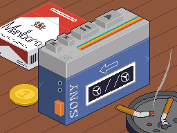
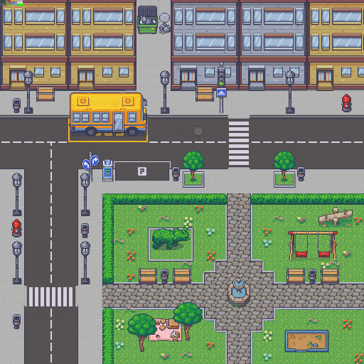
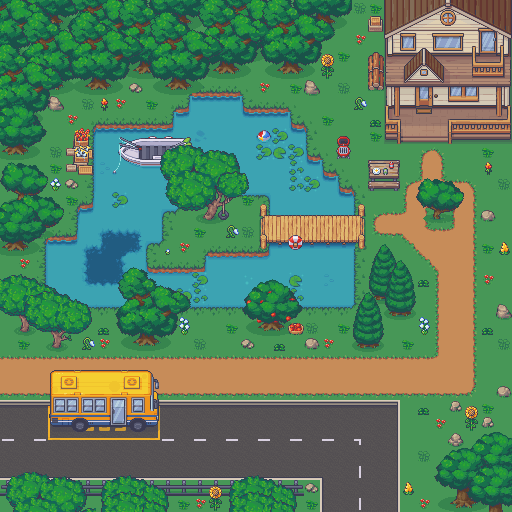
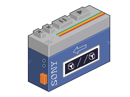

# The Walkman NDS Project

*This project uses a modified version of NDSLIB*

## Gameplay

The walkman is a game that is all about walking while listening to some fantastic tunes on your good old walkman. 

There are 9 songs to choose from using the walkman interface and you can stroll around in 2 custom maps, the city and the countryside.

**Take in the view and relax. **

## Controls 

### Buttons

- You can use the **D-pad** to move in 4 directions up, down, left and right with your character.

- When close to the yellow bus in each map you can press the **A button** in order 
to be tranported to the next/previous map.

### Touchscreen

- 
On the subscreen you can use the touchscreen to interact with the walkman, you can :   
    - skip to previous track  
    - skip to next track  
    - pause and play  
- There's also a special orange button which is a shortcut to transport you back to the other map. 
- It is recommended to use the stylus of the NDS as the hitboxes for the buttons are quite narrow.

## Sources

Musics : https://modarchive.org/index.php  
Tileset and sprite : https://limezu.itch.io/modernexteriors
